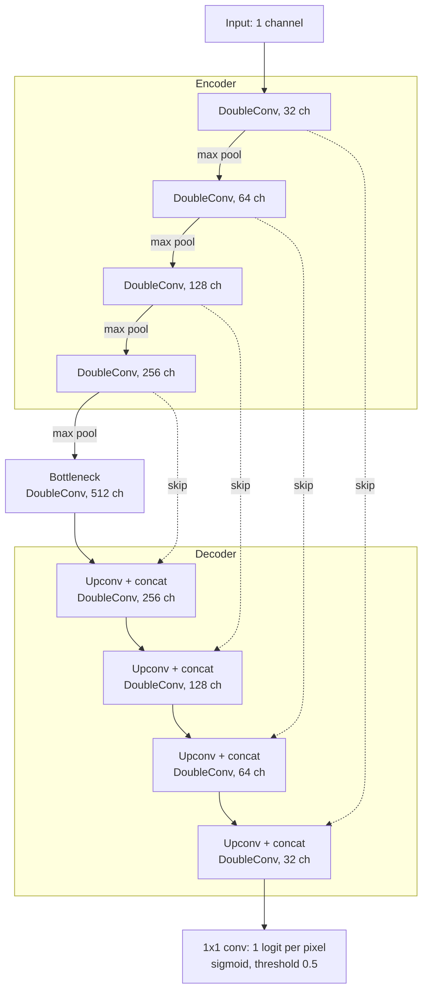
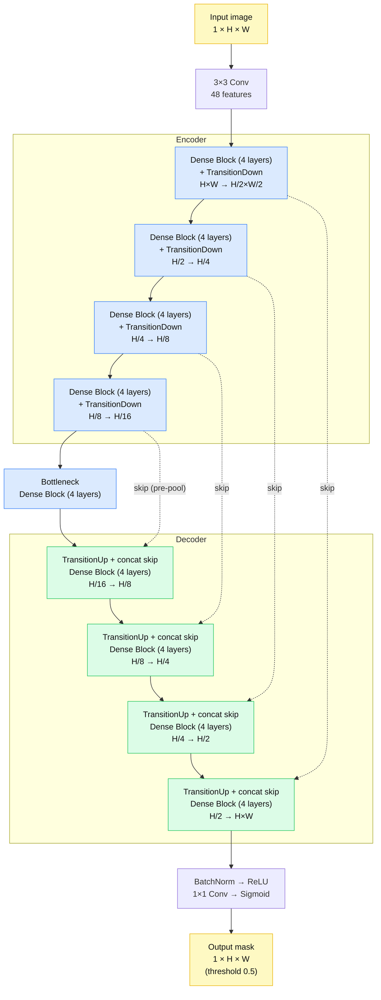

# Semi-Supervised Segmentation of SEM Nanoparticle Images

The aim of this work is to build a pipeline that trains a network on a labelled dataset, and later can be extended to a semi-supervised model to segment images. The pipeline can be implemented using any models. For this attempt I have started with the UNet and Dense-UNet model. This attempt is inspired and derived from the work of Huang et al. (DOI: 10.1039/d6ra02763f), who have done this segementation task on the publically available annotated datasets - NanoSEM-464 and NanoSEM-1707. 

I have chosen NanoSEM-1707 as my dataset. The splits are done according to the paper, which have been conveniently separated into three different files. 

Train, Validation and Test.

Through out the training, the test set is held out to ensure no data leakage and the final reported metrics are of the model on this test set. 


> **Status:** Supervised baselines complete. Semi-supervised training in progress.
---
### Future Work: Semi-Supervised Segmentation

Having established a supervised baseline using U-Net and Dense U-Net, the next step is to investigate semi-supervised learning. The trained model will be used to generate pseudo-labels for unlabelled images from NanoSEM-364. These pseudo-labels will then be used alongside the original labelled training data to fine-tune the network.

The original masks of NanoSEM-364 will be withheld during training and used exclusively for evaluating the final model. The performance of the semi-supervised approach will be compared against the supervised baseline to determine whether incorporating unlabelled target-dataset images improves segmentation performance.
---

## Motivation

Pixel-wise annotation of SEM images is slow and requires domain expertise. This project asks: **how much can unlabelled SEM images improve segmentation when only a small fraction of labels is available?**

Goals:
1. Build strong supervised baselines (U-Net, DenseNet, etc).
2. Use the trained weights to initialise a semi-supervised model trained with unlabelled images.

---

## Images, Masks and Semantic Segmentation

### The data: images and masks

Every sample in this project is a **pair** of files:

- **Image:** a grayscale SEM micrograph. It has a single channel, and each pixel stores how bright that spot appeared under the electron beam.
- **Mask:** a second image of exactly the same height and width. Instead of brightness, each pixel stores a **label** saying what that pixel belongs to. The masks here are binary: pixels with value **255** are the object of interest (the particles) and pixels with value **0** are background. During loading the mask is converted to 0 and 1.

The mask is the "answer key". It was drawn by a human annotator, and it tells the model, pixel by pixel, what it should have found in the image.


*Left: the original SEM image. Middle: the ground-truth binary mask (white = particle, black = background). Right: the mask overlaid on the image in light blue, showing how the mask lines up with the structures in the image.*

Images and masks are matched by file name (`N.png` with `N_mask.png`), so the pixel at position (row, column) in the mask describes the pixel at the same position in the image.

### What is semantic segmentation?

Semantic segmentation is the task of assigning a class to **every pixel** of an image. The output has the same size as the input, so instead of one answer per image, the model gives one answer per pixel.

| Task | Output |
|------|--------|
| Classification | One label for the whole image ("contains particles") |
| Object detection | A bounding box around each object |
| **Semantic segmentation** | **A class for every pixel** (this project) |
| Instance segmentation | A class for every pixel *and* a separate ID for each object |

For this project there are two classes, particle and background, so the task is **binary** semantic segmentation.

### How the model uses images and masks

1. The **image** is fed into the network (U-Net or Dense U-Net).
2. The network outputs a **probability map**: for each pixel, the probability that it is a particle.
3. The probability map is thresholded at 0.5 to give a **predicted mask**.
4. During training, the predicted mask is compared with the **ground-truth mask**, and the error is used to update the weights.
5. On held-out test images, the same comparison is summarised with **IoU** and **Dice**, which measure how much the predicted and true masks overlap.

For the semi-supervised step, the same model predicts masks for **unlabelled images**, which have no ground truth. Its confident predictions are then used as extra training targets.

### Why segmentation masks are useful for physics

A mask is more than a picture. Because it marks exactly which pixels belong to each structure, it can be turned directly into measurements:

- **Area:** count the foreground pixels.
- **Size parameters:** for example the equivalent diameter, derived from the area.
- **Physical units:** pixel counts are converted to real lengths using the scale bar of the SEM image.

### Limitation: touching objects

Semantic segmentation labels *what* each pixel is, but not *which object* it belongs to. If two particles touch, their pixels merge into a single foreground region and are counted as one object, which can bias per-particle size measurements. Separating them requires instance segmentation or a post-processing step such as a watershed transform, which is listed under future work.
---

## Dataset

- **Source:** nanoSEM public dataset (add link/citation here)
- **Task:** binary segmentation (masks contain values 0 and 255)
- **Splits:** separate train / validation / test folders

## Preprocessing

| Split | Images |
|-------|--------|
| Train | 1197 |
| Validation | 342 |
| Test (held out) | 168 |


# Methods

## 1. Supervised baselines

### UNet

**Overview**

This project trains a U-Net from scratch in PyTorch to segment nanoparticles in SEM images. The input is a grayscale 512 × 512 SEM image, and the output is a binary mask in which 1 marks a particle pixel and 0 marks background. Images and masks come from the NanoSEM benchmark and are preprocessed once (masks filled and binarized, everything resized to 512 × 512) before training. The whole pipeline is a single script: data splitting, augmentation, model, loss, training loop, evaluation, and visualization.

**Data handling and augmentation**

The image files are shuffled with a fixed seed and split 70/15/15 into training, validation, and test sets. The split happens at the image level and before any cropping, so patches from the same image can never appear in both training and evaluation data. The split is saved to split.json so that the classical baseline can be evaluated on exactly the same test images. During training, each image contributes eight random 256 × 256 crops per epoch, taken with the same coordinates from the image and its mask. If a crop contains no particles, it is resampled (up to five attempts), except for roughly 10% of crops that are kept as pure background so the model still sees negative examples. Each crop also gets random horizontal and vertical flips and a random 90° rotation, since particles have no preferred orientation. Because crops are drawn on the fly, the model sees different views of the same images every epoch, which increases variety without adding new data. Validation and test use full 512 × 512 images with no augmentation, so scores reflect the whole image, including any text labels and scale bars, which carry empty masks.

**Model and loss**

The network is a standard U-Net with four downsampling stages and a bottleneck, using 32, 64, 128, 256, and 512 channels. Each stage is two 3 × 3 convolutions, each followed by batch normalization and ReLU. The encoder downsamples with max pooling, and the decoder upsamples with transposed convolutions. At each resolution, the decoder concatenates the matching encoder features (skip connections) to recover fine boundary detail. A final 1 × 1 convolution produces one logit per pixel. Training minimizes the sum of binary cross-entropy and soft Dice loss. Since particles cover a small fraction of each image, plain cross-entropy would let the model do well by predicting mostly background. The Dice term directly rewards overlap with the particles and counteracts that class imbalance.

**Training and evaluation**

The model is trained with Adam (learning rate 1e-3, batch size 8, 50 epochs). A plateau scheduler halves the learning rate if validation IoU does not improve for five epochs. After every epoch, the model is evaluated on the validation set: predictions are thresholded at 0.5, and IoU and Dice are computed per full image and averaged. The checkpoint with the best validation IoU is saved, and that checkpoint is the one used for final reporting. The test set is evaluated only once, at the end, after model selection is finished, so the test numbers are not influenced by any tuning. Images where both the prediction and the ground truth are empty are skipped in the metric to avoid undefined scores.

**Output**


**Diagram**




### DenseNet (Dense U-Net)

The DenseNet model is a **Dense U-Net**: a U-Net-style encoder-decoder in which the plain convolution blocks are replaced by DenseNet **dense blocks**. Inside a dense block, every layer receives the feature maps of all earlier layers, which encourages feature reuse and gives smooth gradient flow with relatively few parameters. The U-Net skip connections still carry fine spatial detail from the encoder to the decoder, which matters for sharp particle boundaries.

The implementation is split across three files:

| File | Contents |
|------|----------|
| `dense_unet.py` | Model: `DenseLayer`, `DenseBlock`, `TransitionDown`, `TransitionUp`, `DenseUNet` |
| `dataset.py` | `NanoSEMDataset`: loads image/mask pairs |
| `metrics.py` | `calculate_iou`, `calculate_dice` |

#### Model building blocks

| Module | What it does |
|--------|--------------|
| `DenseLayer` | BatchNorm → ReLU → 3×3 convolution that outputs `growth_rate` new feature maps, which are **concatenated** to the layer's input. |
| `DenseBlock` | A stack of `DenseLayer`s. After `L` layers the channel count has grown by `L × growth_rate`. |
| `TransitionDown` | BatchNorm → ReLU → 1×1 convolution, then 2×2 max-pooling. The features *before* pooling are saved as the skip connection for the decoder. |
| `TransitionUp` | 2×2 transposed convolution that doubles the resolution (with a bilinear resize if sizes do not match exactly), then concatenation with the matching encoder skip connection. |

#### Architecture

```
input (1 × H × W)
  → 3×3 conv (init_features)
  → [DenseBlock → TransitionDown] × 4      (encoder; each stage halves the resolution)
  → DenseBlock                             (bottleneck)
  → [TransitionUp → DenseBlock] × 4        (decoder; each stage doubles the resolution)
  → BatchNorm → ReLU → 1×1 conv → sigmoid
output (1 × H × W), per-pixel probability of "particle"
```

Default configuration:

| Parameter | Value |
|-----------|-------|
| Input / output channels | 1 (grayscale SEM image) / 1 (binary mask) |
| Initial features | 48 |
| Growth rate | 16 |
| Dense blocks per path | 4 encoder blocks, 1 bottleneck, 4 decoder blocks |
| Layers per block | 4 |

The transition layers keep the channel count unchanged (no compression). The output is passed through a sigmoid, so predictions are probabilities that are thresholded at 0.5 to obtain the final binary mask.

#### Dataset loading

`NanoSEMDataset` pairs each image `N.png` in the image folder with its mask `N_mask.png` in the mask folder. Both are loaded as grayscale. After the transform is applied, the mask is binarised (`mask > 0.5`) so it contains only 0 and 1.

#### Evaluation metrics

Accuracy and precision are reported, but because background dominates in binary segmentation, the main metrics are overlap-based:

- **IoU** (Jaccard): `|P ∩ T| / |P ∪ T|`
- **Dice**: `2|P ∩ T| / (|P| + |T|)`

Both are computed per image on thresholded predictions (0.5), then averaged over the batch. A small smoothing constant (1e-6) avoids division by zero on empty masks.



## Results

## Results: U-Net vs Dense U-Net

Both models are evaluated on the same held-out test images, which are never used for training, tuning or pseudo-labelling. Predictions are thresholded at 0.5, and metrics are computed per image and then averaged (mean ± std over the test set).

### Reproducing the evaluation

```bash
python evaluate.py \
    --image-dir data/test/images --mask-dir data/test/masks \
    --weights unet=weights/unet.pth densenet=weights/dense_unet.pth \
    --out-dir results --n-visuals 6 --save-masks
```

This writes `per_image_<model>.csv` (every metric for every image), `summary.md` (the tables below), `comparison.png` (the figure below) and the predicted masks.

### Headline metrics

| Metric | U-Net | Dense U-Net |
|--------|-------|-------------|
| IoU | <> | <> |
| Dice | <> | <> |
| Precision | <> | <> |
| Recall | <> | <> |
| Accuracy | <> | <> |
| Relative area error | <> | <> |

### Full metric table

<!-- Paste the contents of results/summary.md here. It covers overlap, classification,
     boundary (HD95, boundary F1), measurement (area, count, diameter) and probability
     (ROC-AUC, average precision, calibration error) metrics for both models. -->

### Qualitative comparison


*Left to right: test image, ground-truth mask (light blue), and the error map of each model. Green = correctly segmented particle, red = false alarm, yellow = missed particle. The IoU and Dice of each image are printed under its error map.*

### How to read the results

- **IoU and Dice** are the headline scores. They rank the models identically, because `Dice = 2·IoU / (1 + IoU)`.
- **Precision vs. recall** shows the type of error. Low precision with high recall means over-segmentation (many red pixels). High precision with low recall means under-segmentation (many yellow pixels).
- **Accuracy** is high for both models because background dominates, so it is reported for completeness and not used to choose the better model.
- **Relative area error** has a sign. Positive means the predicted particles are larger than the true ones, negative means smaller. This feeds directly into the size measurements.


### 

### Discussion

<!-- Fill in after running: which model scored higher, by how much, on which images the
     gap is largest, what the error maps show (edges? small particles? touching particles?),
     and how the area error affects the physical measurements. -->


## Repository Structure

```
├── data/                 # datasets (not tracked; see Dataset)
├── notebooks/            # exploration and analysis
├── src/
│   ├── models/           # U-Net, DenseNet
│   ├── datasets.py       # data loading and augmentation
│   ├── train.py          # supervised training
│   ├── train_semi.py     # semi-supervised training
│   ├── evaluate.py       # metrics on the test set
│   └── measure.py        # area / size extraction from masks
├── weights/              # trained checkpoints
├── figures/
├── requirements.txt
└── README.md
```

*(Adjust to match your actual layout.)*

---

## Getting Started

### Installation

```bash
git clone https://github.com/<your-username>/<repo-name>.git
cd <repo-name>
pip install -r requirements.txt
```

### Training

```bash
# Supervised baseline
python src/train.py --model unet --epochs <n>

# Semi-supervised
python src/train_semi.py --weights weights/<checkpoint>.pth --unlabelled data/unlabelled
```

### Evaluation

```bash
python src/evaluate.py --weights weights/<checkpoint>.pth --split test
```

---

## Hardware

Trained on a laptop GPU (NVIDIA RTX 3060).

---


## Acknowledgements

- nanoSEM dataset: <citation>
- U-Net: Ronneberger et al., 2015
- DenseNet: Huang et al., 2017

## License

<MIT / other>
